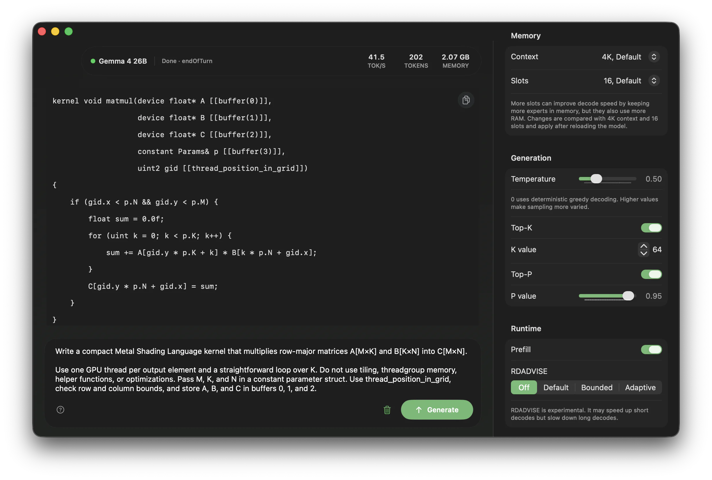

<p align="center">
  
</p>

<h1 align="center">Tsugumi</h1>

<p align="center">
  <strong>16GB の Mac で、ちゃんと使えるローカル AI。</strong>
</p>

<p align="center">
  
  
  
  <a href="LICENSE"></a>
</p>

<p align="center">
  <a href="#使ってみる">使ってみる</a> ·
  <a href="#まだ測っていないこと">測っていないこと</a> ·
  <a href="docs/MAC_APP.md">Mac アプリ</a> ·
  <a href="docs/CLI.md">CLI</a> ·
  <a href="docs/OPENAI_SERVER.md">ローカルサーバ</a> ·
  <a href="docs/SYSTEM_DESIGN.md">仕組み</a> ·
  <a href="#upstream">Upstream</a>
</p>



16GB の Mac の答えは、これまで 8B だった。Tsugumi は、生成結果を落とさずに
13.3 GiB まで絞った **Gemma 4 26B-A4B** を、普段使いの Mac で動かす。
他のアプリを閉じる必要はない。メモリが混んでいれば遅くなるが、止まらない。

> **In English** — Tsugumi runs a 26B mixture-of-experts checkpoint on an
> ordinary Mac by asking the OS for memory instead of reserving it: the process
> itself needs 1.3 GB, and the rest of the 13.28 GiB lives in the page cache,
> which the OS reclaims whenever anything else wants it. Nothing leaves the
> machine. It is a fork of [TurboFieldfare](#upstream); the sections below are
> in Japanese, and the design notes under `docs/` are a mix of both.

## メモリが高い、という話

**Mac のメモリは後から足せない。** 8GB あたり 30,000 円で、この単価は世代が
変わっても下がらなかった。2026-06-25 の改定でさらに上がっている — 16→24GB が
30,000 円から 36,000 円、128GB 構成は 12 万円から 28.8 万円 (2.4 倍)、
Mac mini の最小構成が 94,800 円から 134,800 円。

**これとは別の力として、DRAM 相場そのものが上がっている。** 2026 Q3 の契約価格は
前四半期比 13〜18% 上昇の見通しで、8 月 7 日には DDR4 1Gx8 3200 のスポットが
$42.45 と過去最高を更新した (5 月時点で $20)。原因は構造的で、HBM が DRAM
ウェハの 23% を食っている (2024 年は 8%)。ウェハあたり 3〜5 倍の収益を生む以上、
メーカーが HBM に振り続けるのは合理的な判断であり、大幅な増産は 2027 年後半から
2028 年まで見込めないという見方が強い。

**この 2 つは別の力である。**Apple の価格表が何年も動かなかったことと、
世界的な DRAM 高騰は、原因も時間軸も違う。片方だけを指して
「メモリが高いのは誰かのせい」と言うと、必ずもう片方で反論される。

Tsugumi が節約するのは RAM の使用量ではなく、**30,000 円のほう**である。

## 要る RAM と、借りる RAM

ここを曖昧に書くと嘘になるので、はっきり分ける。

| | 量 | 性質 |
| --- | --- | --- |
| **要る RAM** | 1.3 GB | プロセスが確保する私有メモリ。これが下限 |
| **あれば使う RAM** | 最大 13.28 GiB | ページキャッシュ。**OS がいつでも取り返せる** |

13.28 GiB は「使わない」のではない。空いていれば載るし、載っていれば速い。
売りは *RAM を使わないこと* ではなく、**借りているだけで、いつでも返せること**。
他のアプリが要求すれば OS が取り上げ、取り上げられた分は遅くなる。それだけで、
落ちない・フリーズしない・スワップ地獄にもならない。

- 余裕のある機械 → 速い
- 余裕のない機械 → 遅い
- **どちらでも同じアプリ、同じウェイト、同じ出力**

24GB を買った人が速いのは本当で、それは否定しない。**16GB でも同じものが動いて、
遅くなるだけ**、というのがこのプロジェクトの主張である。

### 「SSD も高いだろう」について

NAND も同時に上がっているし、Apple はストレージも抱き合わせで売る。それでも
非対称がある — **26B 級を 1 本置くのに 13.28 GiB で、256GB の標準構成に収まる。
一方 16GB の RAM には収まらない。**そして決定的なことに、**ストレージは
Thunderbolt で後から足せるが、ユニファイドメモリは購入時の CTO でしか増やせない。**

## 上流とは逆を向いている

Tsugumi は [TurboFieldfare](#upstream) のフォークで、動機は同じ「メモリが高い」
である。設計は逆を向いた。

**上流は予算を切った。** 2 GB という上限を決めて、自前のエキスパートキャッシュで
その中に収めた。**Tsugumi はその自前キャッシュを捨てて、OS のページキャッシュに
預けた。**上限を決めるのをやめた、と言ってもいい。だから「もっと節約した」ではなく、
同じ動機から反対側に歩いた結果として、上の表のような性質になっている。

## なぜ 26B なのか

ローカル LLM が動いた、という記事は氾濫している。ただし中身は E4B か 12B が多い。
12B は「12〜16GB の VRAM に載るのが利点」の中間サイズで、E4B は単機能特化である。
用途が書かれていない記事が多いのは、書けるほどの用途がないからだと思う。

本格的に使えるのは 26B の MoE からで、**Gemma 4 の日本語の強みがそのまま出るのも
このサイズ**である (日本語の自然さ・指示追従・長文処理については外部の評価が
すでに固まっているので、ここで証明はしない)。そして 26B は 16GB には載らない、
というのが定説だった — Q4_K_M で 16〜18 GB 要るからである。

Tsugumi が置いた石はここで、**QAT ウェイトを、生成結果を変えないまま 13.28 GiB
まで落とした**。温度 0 で 256 トークン × 3 プロンプトのバイト一致と、ルーティングの
一致まで確認してある ([docs/mtp/45](docs/mtp/45-W2-SYM-ADOPTION.md))。

ダウンロードが 15.7 GB あるのは、この本体に vision タワーと MTP ドラフタが
乗るからである。どちらも別ファイルで、使わない実行では読まれない —
上の表の 13.28 GiB は本体のぶんである。

**この設計は QAT が前提で成立している。** Gemma 4 は QAT の公式配布が全サイズ
揃っていて、26B-A4B には MTP ドラフタが同梱される。だからこの話は Gemma 4 でしか
語れない。

同じ器で **Ornith-1.5 35B-A3B** も動くが、こちらは主役ではなく、
**器が特定のモデル専用ではないことの証明**として置いてある。

| | [Gemma 4 26B-A4B QAT](https://ai.google.dev/gemma/docs/core/model_card_4) | [Ornith-1.5 35B-A3B](https://huggingface.co/ornith-ai) |
| --- | --- | --- |
| 位置づけ | 主役 | 器の汎用性の証明 |
| ダウンロード | 15.7 GB | 21.0 GB |
| 画像 | 1 メッセージに 4 枚まで | なし |
| 思考 | トグル、既定 OFF | トグル、既定 ON |
| 投機デコード | ドラフタ、ブロック 4 | MTP ヘッド、幅 2 |

## まだ測っていないこと

数字はすべて **18GB の M3 Pro** で取ったものである。以下は正直に未検証である。

- **16GB の実機で測っていない。** 上のコンセプトの成否そのものがここに懸かる。
- **`iogpu.wired_limit_mb` の既定は概ね 75%** で、16GB 機なら約 12GB。13.28 GiB は
  素の上限を超える。ページキャッシュ経由のファイルバックなら wired にはならない
  はずだが、**そこが設計どおり効くかは 18GB 機では検証できない。**
- **外付け SSD での動作を測っていない。**理屈上は動くはずで、上流の設計に対しては
  16GB M4 mini + 外付け 990 Pro の
  [コミュニティ報告](docs/COMMUNITY_BENCHMARKS.md#community-results)がある。
  Tsugumi の現在の設計でも同じかは未確認。
- 見るべき数字は**最大 tok/s ではなく、混雑時の下限**である。Chrome や Slack を
  開いたままの t/s と、そのとき OS が固まらないこと。「速い」より「壊れない」を
  数字にする必要がある。

測った数字は [docs/BENCHMARKS.md](docs/BENCHMARKS.md) に、他の機体からの報告は
[コミュニティベンチマーク](docs/COMMUNITY_BENCHMARKS.md)にある。
**16GB の Mac からの報告が、いま一番ほしい。**

## 使ってみる

```bash
git clone https://github.com/he-be/tsugumi.git
cd tsugumi
swift build -c release
.build/release/TsugumiMac
```

リリースビルドはアプリと、その隣で動く decode service を作る (アプリはモデルと
Metal をこのプロセスに持たせる)。初回は Swift Package Manager がトークナイザの
パッケージも取ってくる。

アプリが開いたら **Download** を選ぶ。既定は Gemma 4 で、完成品のパック
(15.7 GB) がそのまま降ってくる。全ファイルが SHA-256 のピンと照合され、
一致したものだけがインストール先に入る。あとは **Load Model** を選んで打ち始める。
Ornith は後から同じ画面で足せるが、ディスクが厳しい機体で先に入れるものではない。

### 動作要件

- Apple Silicon の Mac。狙いは普通の 16GB 機で、開発機は 18GB の M3 Pro
- macOS 15 (Sequoia) 以降。arm64 のみで、macOS 14 以前は対象外
- Xcode 26 / Swift 6.2 以降
- モデルのディスク: Gemma 4 が 15.7 GB、Ornith が 21.0 GB
- 初回インストールのためのネットワーク

macOS 26 では Metal 4 / MSL 4.0 のテンソルカーネル (MPP の prefill matmul と
tensor-ops の prefill attention) が有効になる。macOS 15 ではシェーダが MSL 3.2
として compile され、それらは `__HAVE_TENSOR__` のガードで落ちて、可搬な
prefill カーネルに退く。decode は変わらず、prefill だけが macOS 15 で遅い。

## Mac アプリ

打った文字はそのまま指示として扱われる。チャットテンプレートも思考チャネルも
アプリ側では見えない。

1. **Load Model** を選ぶ
2. コンポーザにプロンプトを書く
3. **Generate**、または <kbd>Command</kbd>+<kbd>Return</kbd>
   (**Settings > Send Message With** で Return に変えられる)
4. 途中で止めるのは停止ボタンか <kbd>Escape</kbd>

会話はマルチターンで、左のサイドバーに並ぶ。
`~/Library/Application Support/Tsugumi/chats.json` に保存され、再起動しても
戻ってくる。**チャットはモデルに紐付かない**ので、一方のチェックポイントで
始めた会話をもう一方で続けられる。生成は同時に 1 本だけで、生成中に別の
チャットへ切り替えてよい — 出力は始めたチャットに流れ続ける。

サンプラの既定は各チェックポイントの公式値である (Gemma は temp 1.0 /
top-k 64 / top-p 0.95 で編集可、Ornith は 0.6 / 20 / 0.95 で固定)。
コンテキスト長・エキスパートキャッシュ・prefill などは右ペインで、
詳細は [Runtime controls](docs/RUNTIME_CONTROLS.md) と
[Mac アプリの設計メモ](docs/MAC_APP.md) にある。

画像は Gemma のパックだけが受ける (1 メッセージ 4 枚まで)。Ornith はテキスト専用で、
音声と動画はどちらも対象外。ツールの実行はアプリも CLI もしない。

## CLI とローカルサーバ

同じ `.moepack` を、アプリを開かずに使える。

```bash
swift build -c release --product TsugumiServer
.build/release/TsugumiServer --model scratch/gemma4-qat-sym.moepack
```

`http://127.0.0.1:8080/v1` で Chat Completions、ストリーミング、function tools、
`data:` URI の画像、投機デコード、プロンプトキャッシュに応じる。**ツールの実行は
クライアント側の責任**で、TLS も認証も無いのでループバックから出さないこと。

- [コマンドライン](docs/CLI.md) — `TsugumiCLI` と `TsugumiRepack`
- [ローカルサーバ](docs/OPENAI_SERVER.md) — API のサブセット、Python と OpenCode の設定
- [サーバ運用メモ](docs/SERVER_RUNBOOK.md) — この M3 Pro で載る文脈/スロットの組み合わせ

モデルを持つプロセスは、アプリ・CLI・サーバのどれか 1 つだけを同時に動かすこと。

## 仕組み

各層で、Metal が常駐ウェイトから attention とルータを計算する。CPU はルータの
上位 8 エキスパートを見て、その層のマッピングから必要なエキスパートだけを
`MTLResidencySet` に入れ、GPU はそのバッファを直接読む。**層のファイルは
`MAP_SHARED` で張りっぱなし**なので、常駐になるのはコマンドバッファが名指した
ぶん (1 層あたり 26.9 MB) だけで、残りは OS のページキャッシュの側にいる —
これが「借りて、返せる」の実装である。私有スロットに `pread` していた旧経路は
`TF_EXPERT_MMAP=0` で戻せる (A/B の測定用)。

くわしくは [システム設計](docs/SYSTEM_DESIGN.md)、
[最適化の記録](docs/OPTIMIZATION_JOURNEY.md)、
[実験一覧](docs/experiments/EXPERIMENT_INVENTORY.md)。

## テストと貢献

```bash
Scripts/test.sh
```

モデルを走らせる前に、重いアプリを閉じて `memory_pressure -Q` を見ること。
比較可能な性能値を出すときは
[コミュニティベンチマークの手順](docs/COMMUNITY_BENCHMARKS.md)に従うこと。
貢献の作法は [CONTRIBUTING.md](CONTRIBUTING.md) にある。

## Upstream

Tsugumi は **Andrey Mikhaylov** の
**[TurboFieldfare](https://github.com/drumih/turbo-fieldfare)** (Apache-2.0) の
フォークである。エンジンの骨格は彼のもので、`.moepack` コンテナ (彼は `.gturbo`
と書いた)、ストリーミング repack、境界のあるエキスパートキャッシュ、量子化 GEMV・
attention・MoE・正規化・RoPE・サンプリングの Metal カーネル、そして最初の Mac
アプリまでが彼の仕事である。これが無ければ以下のどれも存在しない。彼の Afterword は
本人の文章としてそのまま残してある。

名前もそこから続いている。fieldfare は _Turdus_ = ツグミ属で、同じ鳥を、この
フォークが書かれている言語で呼び直しただけである。ツグミの語源は「口をつぐむ」
だという説があり、それはこのアプリの性質そのものでもある — 言われたことは、
この Mac から出ていかない。

フォークで足したもの: 2 つ目のアーキテクチャ (Qwen3.5-MoE / Ornith-1.5、線形
attention 層と自前の MTP ヘッド)、両家族の投機デコード、ピン留めした llama.cpp を
参照実装として書いた OpenAI 互換サーバ、プロンプトキャッシュ、QAT の対称量子化
経路、vision タワー、2 モデルを跨ぐマルチターンのチャットに作り直した Mac アプリ。
それぞれの根拠になった測定は `docs/` にある。

## ライセンスとモデルの条件

Tsugumi のソースとドキュメントは [Apache License 2.0](LICENSE) である
(派生元の上流も同じ)。

**ウェイトは同梱していない。**アプリが別途ダウンロードし、それぞれの条件に従う:

| ウェイト | 条件 |
| --- | --- |
| Gemma 4 26B-A4B | Google は Gemma 4 を [Apache License 2.0](https://ai.google.dev/gemma/apache_2) で配布している。ただし投機に使うドラフタは `license:gemma` の成果物なので、[Gemma の利用規約](https://ai.google.dev/gemma/terms)が付いてくる |
| Ornith-1.5 35B-A3B | MIT (上流のチェックポイント) |
| Ornith の MTP ヘッド | Apache 2.0 (shisa.ai の公開物から移植) |

完全なレビューは [THIRD_PARTY_NOTICES.md](THIRD_PARTY_NOTICES.md) にある。

Tsugumi は独立した研究プロジェクトであり、Google、Alibaba その他いかなる
モデル公開元とも提携・後援・推薦の関係にない。

## Upstream's afterword

The section below is Andrey Mikhaylov's, from TurboFieldfare, unchanged.

Thanks for checking out this project!

My name is Andrey Mikhaylov. You can find me on
[LinkedIn](https://www.linkedin.com/in/andrey-mikhaylov-ios-dev/).
I am the author of TurboFieldfare and an iOS and Metal engineer. Most of my
work is with images, video, and on-device AI.

I dedicate this project to my wife, Sasha, the most supportive person I know.
She stands by me even through the hardest times. She loves wildlife, goes
birdwatching, and volunteers with our local birding community. Because of her,
I have also grown closer to birds and nature.

TurboFieldfare is named after the fieldfare, a member of the thrush family and
my favourite bird. It is not the most noticeable or brightly coloured bird, but
it definitely has a character and unique features of its own. I think the same
is true of this project: it may not be the most practical, but I built it with
my favourite tools, especially Metal, in my favourite field, on-device ML
inference. It definitely has its own character and unique features.

Next time you are outside, touch the grass and listen to the birds. Sometimes
it is the most beautiful thing you can do. And if you can, support your local
wildlife community. They do important work.

Thank you!
